name:inverse
class: center, middle, inverse
layout: true

---

# 开源框架各目录作用与详解

## 时间： 2020/3

???

该文档是开发文档，是对[开源框架 API 文档](http://118.24.154.79:6767/)的补充。 接下来会比较详细的介绍每个目录里的代码作用

---

# 目录

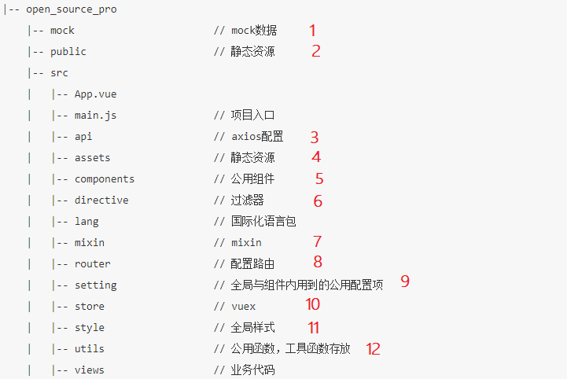
???
接下来按目录逐个讲解

---

# 1. mock

## 项目中 mock 的配置和使用

???

Mock 数据在我们的业务中用的很少，因为接口大多数都是现成的，不需要 mock 数据的调试。 但很多时候还是很有用处的，比如模拟场景（模拟 token 超时登录， 需要大量数据调试样式）等等，对调试很有帮助。 现在演示下这种 mock 的使用方式

1：vs-code 安装 EasyMock

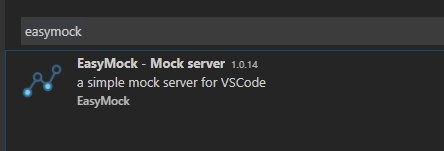

2: 运行 mock 服务器。 此时会启动一个本地服务，这时候访问该服务器就能使用配置好的 mock 数据了

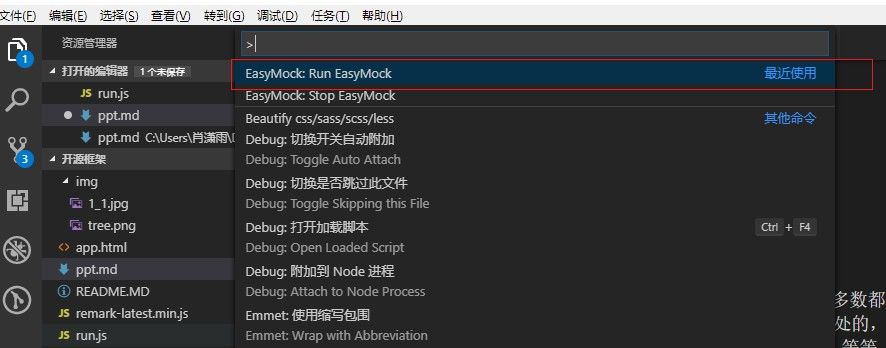

3：给要调试的接口更换请求方式

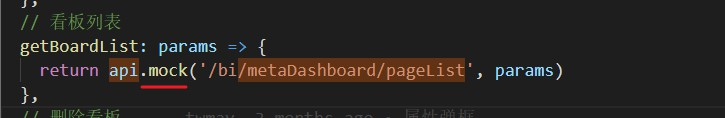

4：在 mock 目录里依葫芦画瓢配置该接口的数据

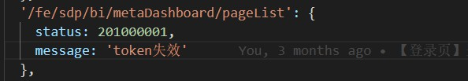

5：此时调用该接口，接口返回的就是自己设置的值了。 mock 数据支持设置随机数，随机字符串，对象循环等等。 配置方法可以在 vs-code 扩展里的 EasyMock 介绍里查阅

---

# 2.public

## 静态资源

???

静态资源目录，可直接在地址栏通过[域名]/[文件名]访问该目录中的文件。 存放了启动的 index.html 和一些图片

该目录下的 【subscription.html】文件是报表组放入的，有疑问可以问他们

---

# 3.api

## axios 配置

???

接口请求的全局封装都在该目录中进行

---

## 3.1 index.js

### 项目中使用的 axios 实例封装

## 3.2 sdpAxios.js

### 给报表使用的 axios 实例

???

该两个文件都是对 axios 进行封装： http 的请求前设置和请求后拦截。 流程和处理与 oms 基本一致， 详细逻辑不解释。

区别：

index: 拦截器收到报错后不做任何处理，将错误继续抛下去。

sdpAxios: 因为报表的所有接口是直接报错，所以在拦截器中统一处理报错

注意：

传参给报表使用的 axios 实例一定要是 sdpAxios.js。 否则报表的接口报错将不会提示

---

## 3.3 urls.js

### 访问地址配置

???

该目录下是根据不同的环境配置不同的地址。 本地可以切换 env 的值来在不同的环境中调试。 注意：提交的时候一定要记得切回默认的。

属性的含义：

- baseUrl： 接口的域名
- wss： websocket 连接的接口地址
- sdpPath: 引入报表文件的地址

问题： 为什么不像 oms 里一样，接口的请求地址是和地址栏一致呢？

答： 开源框架是给第三方企业帮助他们与 SDP 后端联调的一个前端框架。 企业会将该前端项目部署在他们自己服务器上， 这时候若是采取[问题]中方案的话，那是无法成功访问到我们 SDP 的接口的。

---

# 4.assets

## 字体，图标，图片等保存目录

???

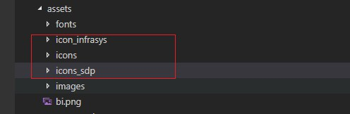

项目中使用的字体图标都保存在该目录下。

- icons_sdp sdp 看板使用的图标（仅为了报表内的图标正常显示）
- icons 开源框架使用到的图标
- icon\_[项目名] 第三方企业的自定义图标可以在该目录下新增

---

# 5.components

## 封装的全局组件。

???

文档中基本都有介绍

---

## 5.1 dialog

### 统一的提示弹窗

???

该组件对 element 的 $confirm和$alert 做了额外封装。有很多额外代码，产生原因如下：

遇到问题 1： 在 safrai 浏览器中，短时间内多次弹窗会有 bug（如：二次确认）。 弹窗之间有 500ms 延迟则不会有问题
处理方式： 保证弹窗之间有 500ms 延迟。 设置一个 setTimeout，若两次弹窗时间低于 500ms，则到 500ms 时再弹出下一个框

引发问题 2： 未知 bug，问题 1 引发 2。 疑似\$t(i18n)在 setTimeout 中，会引发报错
处理方式: 额外的 if 判断，不需要延迟时弹窗时则不给函数包裹 setTimeout，逻辑上好像确实还有坑，但是实际没有再遇见过问题。

---

## 5.2noLoginLanguage

### 登录，忘记密码，修改密码等页面切换语种的公用组件

???

登录前的语种保存在 Cookie 中的 noLoginLanguage 字段里。

也能通过 Vuex 里的 language 域中的 language 获取当前登录前语种。

通过 setNologinLanguage 这个 ation 设置改变登录前语种。

切换语种后，该组件会触发 change 事件

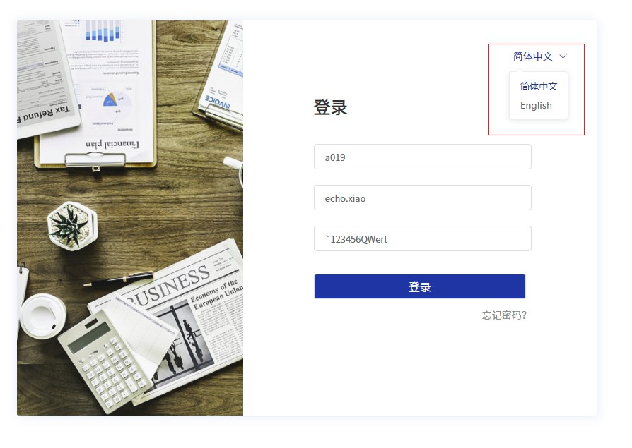

---

## 5.3 sjTree

### 树组件

???

需求中要求树组件是全线条显示的。但我们用的 UI 库里并没有该交互。 为了降低开发成本和使用者上手门槛， 我选择在 element 2.8.2 版本的树组件模块源码基础上加上了该交互。 没有改动功能，使用上参考 2.8.2 的文档

主要改动原理：
1、观察树组件源码和在页面中的显示，可以发现。 树的 DOM 主要是由两个元素相互嵌套生成：

- 1.1 el-tree-node\_\_content ： 树的每一项节点。
  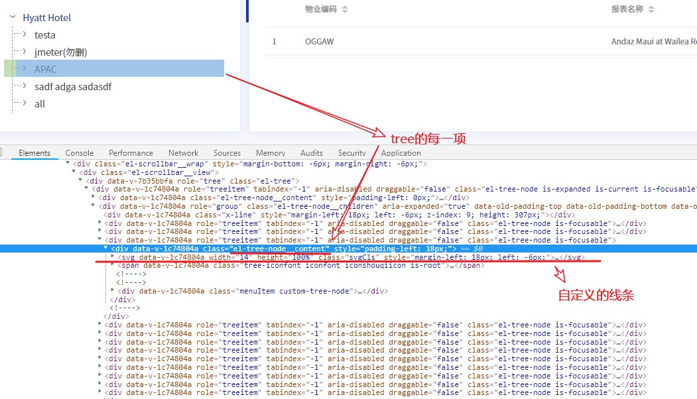

- 1.2 el-tree-node\_\_children ： 节点展开的区域
  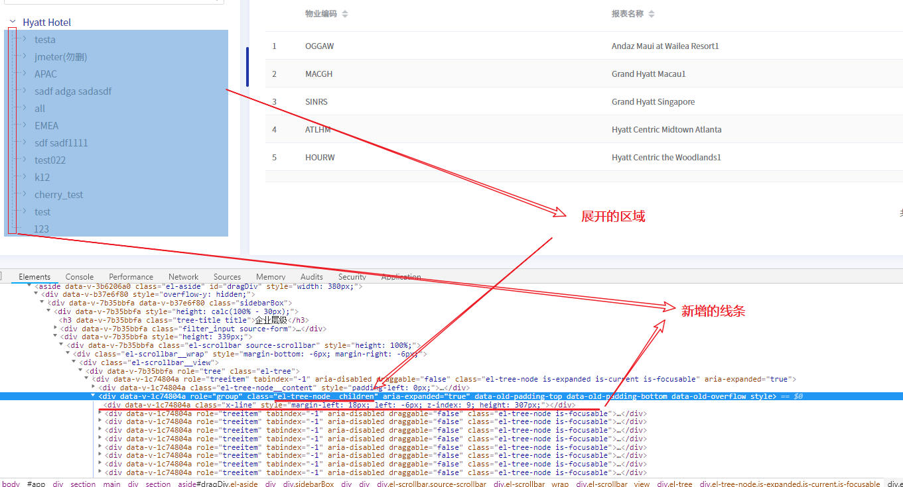

在`tree-node.vue`该文件中修改，在上述元素前加好线条，并计算好 X-line 的高度和离左边的间距

---

# 6.directive

## 自定义指令

???

目前创建了两条自定义指令，用来控制按钮权限

- v-has: 传入按钮编码，要是没有权限则删除该元素 dom（按钮）

- v-routeHas: 传入路由，要是没有路由权限删除该元素 dom（router-link,a 标签）

指令的实现函数也被注册到了全局，调用函数（传入按钮编码|路由）执行结果返回 true 或 false 来判断是否有该权限

- \$\_has

- \$\_routeHas

注意踩坑： table 行里的操作按钮，不要用指令去删除节点，切换页面会报错，使用 v-if="\$\_has('编码')"去处理

建议都推荐使用内置指令 v-if 去判断是否显示该元素，因为这样在虚拟 DOM 这一层就不让没有权限的 DOM 元素生成，这才更加合理。

相比自定义指令，优点显而易见。 v-has 和 v-routeHas,都是会等到元素渲染到页面之后再进行权限判定，判定为 false,则再删除元素。（众所周知，DOM 的操作很慢）

---

# 7.mixin

## 混入

???

---

## 7.1 asyncMethods

### [介绍文档（点击跳转）](http://118.24.154.79:6767/gitbook/%E6%96%B0%E5%A2%9EAPI.html)

???

asyncMethods 的创建初衷,是为了实现以下这套对接口异常处理的流程：

惯用的方案很简单，在 axios 响应拦截器内对异常状态进行处理，处理完之后再抛出。

但开源框架很多需求都希望能将异常用特定方式显示。 所以希望能够实现先在业务代码内处理异常，再走全局异常处理。

实现原理： vm 的 beforeCreate 钩子中，将 asyncMethods 中的函数遍历和包装后，一一加入进 method 中。 其中包装的处理有：可以配置节流和防抖、 利用 promise 捕获该函数执行后的异常，做出全局处理、 将该函数的执行状态加入进 loadingEffect 用于充当 loading。

注意问题：

- 1:asyncMethods 中的函数一定要返回 promise，否则会报错

- 2:需要系统处理异常时，一定要保证异常能够被抛出去， 自己 catch 拦截处理后那系统是收不到异常的。 比如这 bug
  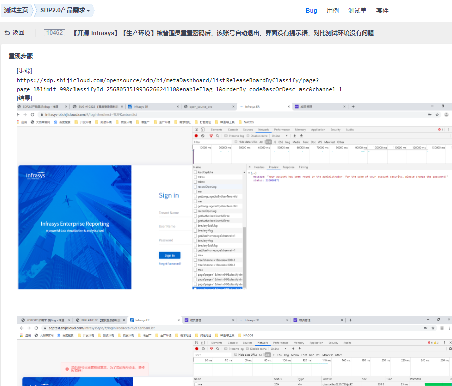
  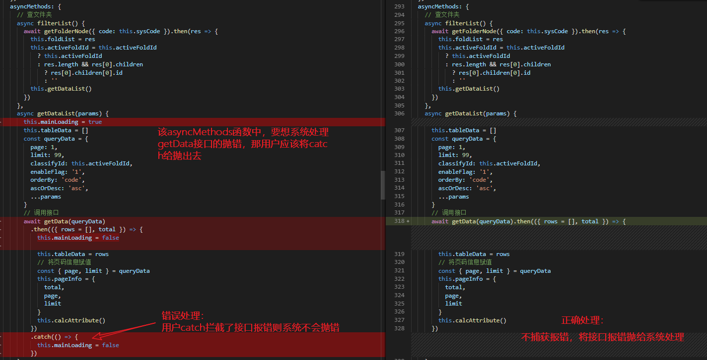
  建议处理应该是不去 catch， `mainLoading`状态的维护替换成`loadingEffects.getData`。 实在是避免不了 catch，那要自己手动再将异常给抛出去：
  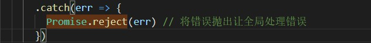

- 3: 还有以下这种特殊情况的处理：
  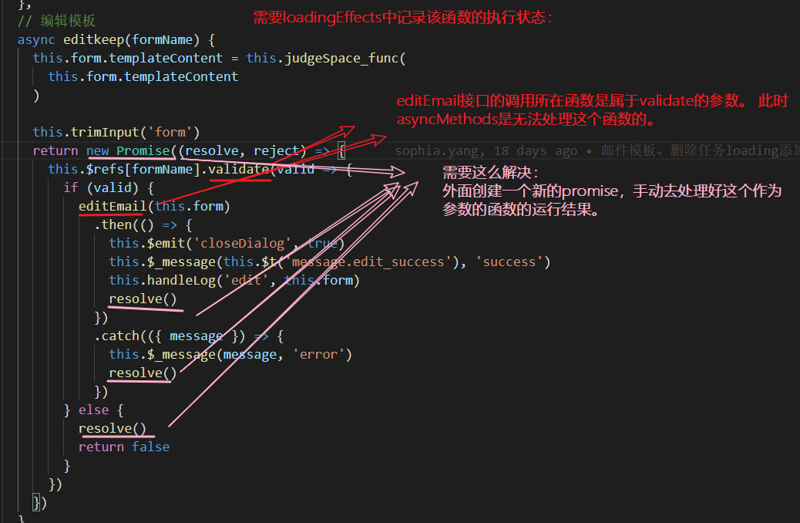

---

## 7.2 tableHeight

???

当初从 oms 移过来，计算 table 高度的 mixin。 但是这算出来的高度无法适配所有页面，建议后续不要再使用这 mixin。

---

# 8.router

## 路由

???
重点介绍下全局路由逻辑，流程图如下： 代码里也做了足够的注释，结合流程图来看一目了然

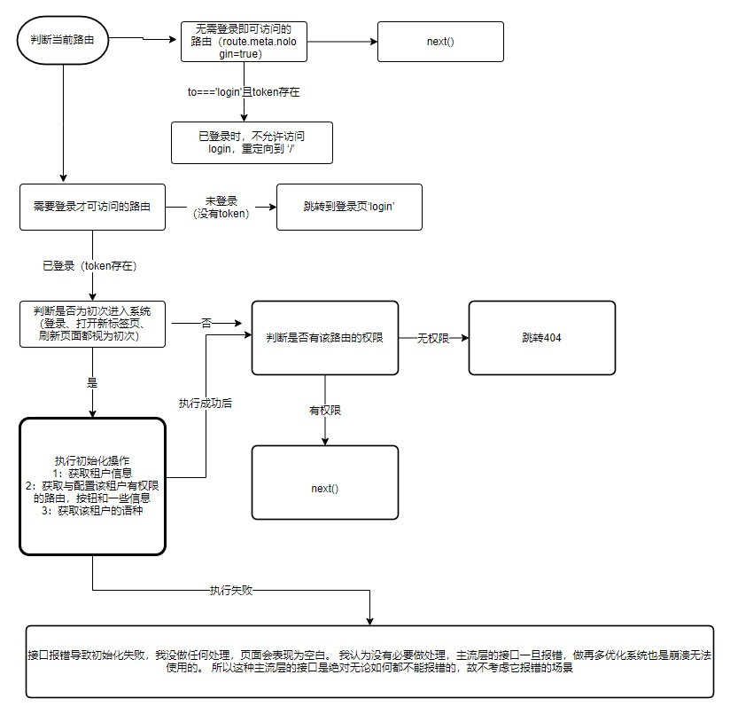

---

# 9.setting

## 全局配置项

???

一些全局使用的配置项，map 对象可以存放在该文件夹里

---

# 10.store

## vuex 的使用

???
全局性共享状态才考虑加入进 vuex 中

目前将 store 分割成了四个模块

- 1 permisson: 路由、按钮等权限有关处理和数据的都在该模块内
- 2 message: 实时的消息推送操作都在这里面进行
- 3 language: 登录前和登录后的语种处理
- 4 global: 除上述外的别的状态管理都归纳进这里

下列详细说说每个模块内都有哪些处理

---

## 10.1 permisson

### 路由、按钮权限处理

???
主要维护的属性：

- 1 menuList 菜单树， 体现了整个系统的 模块->页面->按钮 的数据。 作用： 开源框架系统里的模块，页面显示和面包屑都由该数据生成。

- 2 btnRoleList 有权限的按钮 key 集合。 作用： 鉴别某按钮是否有权限，只需判断该按钮的 key 是否存在于该数组里即可

- 3 routeList 有权限的路由集合。 作用：鉴别某路由是否有权限，只需判断该路由是否存在于该数组里即可

- 4 routeInfoMap 路由的信息 Map。 内部包含了路由的 menuI18Key、modelI18Key 等详细数据，通过 routeInfoMap[路由] 获取。

主要 action:

- getAuthorizedUserAllTree: 调取接口获取菜单树，并整理好上述属性。 该 action 在 router/index 中，初次进入系统时调用

---

## 10.2 message

### 消息通知模块

???
主要维护的属性：

- 1 newsMessageCenterList 显示在右上角的[消息]里的未读消息数据

- 2 newsMessageCenterLength 显示在右上角的[消息]里的未读消息条数

- 3 subRemindList 显示在右上角的[提醒]里的未读订阅提醒数据

- 4 subRemindLength 显示在右上角的[提醒]里的未读订阅提醒条数

主要 action:

- getMessageCenter: 更新未读消息数据时调用， 维护 1,2 属性。

- get_subscription_List：更新未读订阅提醒数据时调用， 维护 3,4 属性

- newWebscoket 创建长链接，实现实时推送。 在 layout/the-header 的初始化钩子里调用（登录的用户进入系统初始化时创建长连接接受消息，登出和退出系统时关闭长链接）

- closeWebscoket 关闭长链接。 登出的 action 里调用

---

## 10.3 language

### 语种管理

???
主要维护的属性：

- 1 language 当前页面正在使用的语种

- 2 languageList 所有可选择的语种列表

主要 action:

- setNologinLanguage： 无需登录的页面切换和设置语种时调用（登录、找回密码、修改密码等页面），下述说的 action 都是在登录后的页面里使用。

- getLanguageList： 获取语种列表，维护属性 2

- switchLanguage 切换语种时调用该 action 即可将当前语种存储起来

- languageInit 不知道当前该使用什么语种时使用（初始化的时候调用， 还有就是在语言管理模块里删除了当前语种，调该 action 会自动切换成默认的语种）

---

## 10.4 global

???
主要维护的属性：

- 1 sysCode 废弃（需求改动，3/12 向杨峰确认页面里有关该属性的接口传参都可以删除）

- 2 mobileCode 废弃（需求改动，3/12 向杨峰确认页面里有关该属性的接口传参都可以删除）

- 3 token 登录的账号唯一标识。 也可通过 Cookies.get('token')获取

- 4 loginBtnLoading login 页登录按钮的 loading 状态。 因为用户登录成功后，还需调取一些必须接口进行初始完成后才会跳转新的页面。 所以这段过程通过该属性显示 loading 来提供良好交互

- 5 routeAdded 第一次加载路由的开关

- 6 publicKey 与后端约定的 CryptoJS 加解密的 key 钥。

- 7 tenantInfo 当前登录用户的信息

- 8 modelI18Key 当前页面的 modelI18Key （一级菜单）

- 9 menuI18Key 当前页面的 menuI18Key（三级菜单）

- 10 importSDPResult 记录引入报表组件结果(success 成功， error 失败) 打开看板前需要通过该属性判断是否引入报表成功

主要 action:

- setTenantId 维护 7（tenantInfo）字段。 接口返回用户信息很多，我只取出有用到的存在该属性里

- removeToken 登出调用。 里面做了所有登出时该做的处理（重置 vuex,注销 token，关闭长链接，跳转 login 等等）

- encrypt 加密 传入字段，返回 CryptoJS 加密后的字符串。 除了密码加密，地址栏里敏感信息也通过加密传输

- decodeFunc 解密 传入 CryptoJS 加密后的字符串，返回解密后的值

- setRouteI18nkey setRouteI18nkey 获取当前路由的一级和三级菜单。 维护 8（modelI18Key）,9（menuI18Key）字段

- importSDPComponents 引入报表组件。 项目初始化时调用该 action

- openSdpBefore 打开看板前，调用该 action 可以判断是否下载成功，失败。返回 promise。 参数可传入`this`来告知让系统来处理

---

# 11. Style

## 全局样式

???

init.cass 文件里都是对全局标签，全局通用的类名的样式定义。

components.scss 是对全局通用的组件样式定义

variables.scss scss 变量定义&存放

---

# 12. utils

## 封装函数

???

多处会使用的函数可以封装在该目录下。

globalTools/tool.js 是全局工具函数，在该目录内定义的函数 vm 内可以通过`this.$_函数名`去调用

auth.js 内部都是对 cookie 进行的操作封装

---

# 13. 可以优化的点

???

[Vue 官方风格指南](https://cn.vuejs.org/v2/style-guide/)

尽量按文档的规范去做，开源框架并没有很好的参略好，后续希望能改进

---

## 13.1 项目目录结构

???

页面目录结构，目前以 模块/页面 形式进行划分，这样划分本身没有什么问题，是可以的。

但是不适用于我们场景，后台管理系统可以随时将某个页面规划到别的模块中。

页面是独立的，与菜单没有直接关系，菜单只是对用户的体现，所以，以模块/页面 形式进行划分有点不合理。

---

# 结束

## 日期：2020/3/13

---

## 补充一个另外的项目

### showDoc

???

前端项目在该目录中：/web_src

配置地址: /web_src/index.html 中的 window.DocConfig 里

- server 请求的接口域名配置

- lang 多语言配置（`en`：英文，`zh-cn`: 中文）

本地服务请求接口要设置代理：
/web_src/config/index.js 中的 dev.proxyTable['/server/']设置要代理的服务器域名

分支：目前所有环境打包都是 develop 分支
